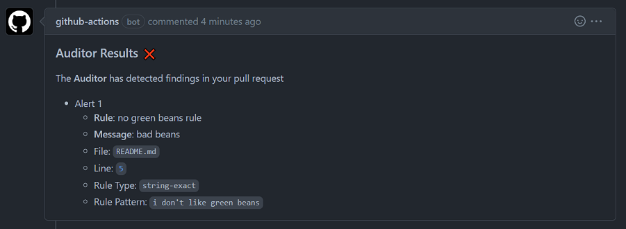
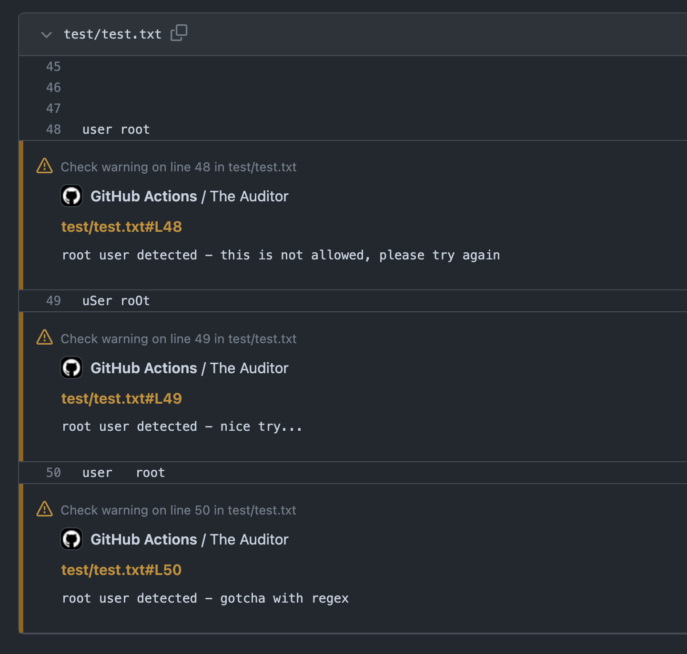

# auditor-action 👮

> *The Auditor*

A GitHub Action that audits changes made in a pull request, using a customizable configuration.

## About 💡

> This is a composite GitHub Action which does a few things under the hood. It will be explained in this section

**The Auditor** looks at every single line of changes in a pull request and then audits each line based on a custom configuration which you provide to it. The config file contains a rule set of string and regex matches to look for violations on each line of the diff. If a violation is found, The Auditor will comment on the pull request with your custom violation message and a link to the line of code where the violation was found.

All the collective pieces that make up this composite Action are referred to as **The Auditor**

### How It Works 🔨

As mentioned earlier, The Auditor is a composite GitHub Action. This means that it is composed of multiple GitHub Actions that work together. In fact, the Actions that it is composed of, were designed specifcally for this purpose.

Below is a high level over view of how this composite Action works:

1. [actions/checkout](https://github.com/actions/checkout) is called and checks out your entire repository
2. [GrantBirki/git-diff-action](https://github.com/GrantBirki/git-diff-action) is called and a diff in JSON format is generated for the pull request
3. [GrantBirki/auditor-action-core](https://github.com/GrantBirki/auditor-action-core) is called and the JSON diff from the previous step is passed into the `auditor-action-core` Action
4. The `auditor-action-core` Action reads your `auditor.yml` config file and audits the diff for violations
5. If violations are found, the `auditor-action-core` Action will comment on the pull request with your custom violation message and a link to the line of code where the violation was found

The composite Action will either pass or fail based on the inputs you provide it. You can optionally disable the comment feature as well if necessary. Please see the [Inputs](#inputs-) section for more information.

> It should be noted that this Action **only** works for pull requests. It will not work properly in any other Actions context

## Usage 🚀

Below is a sample Actions workflow that uses **The Auditor**:

> `vX.X.X` is the version of the Action you want to use. Please see the releases page for the latest version

```yaml
name: the-auditor

# run on all pull requests
on:
  pull_request:

permissions:
  contents: read # needed to view the config file and the git diff
  pull-requests: write # needed to publish a comment on pull requests
  checks: write # needed to publish annotations on the pull request files tab
  actions: read # also needed to publish annotations on the pull request files tab

jobs:
  the-auditor:
    runs-on: ubuntu-latest
    steps:
      - name: auditor-action
        uses: GrantBirki/auditor-action@vX.X.X
        with:
          config: config/auditor.yml # path to your 'auditor.yml' config file in your repository
```

## Inputs 📥

These are the inputs that the Action accepts in its workflow file:

| Name | Required? | Default | Description |
| --- | --- | --- | --- |
| `config` | yes | `config/auditor.yml` | The path to the [`auditor.yml`](#configuration-) configuration file |
| `json_diff_path` | yes | `diff.json` | The path to the JSON diff file to load (provided for you out of the box) |
| `github_base_url` | yes | `https://github.com` | The base URL for the GitHub instance you are using |
| `annotate_pr` | yes | `"true"` | Whether to annotate the PR with the audit results or not |
| `annotate_name` | yes | `The Auditor` | The name of the annotation to name to use |
| `annotate_title` | yes | `The Auditor has detected findings in your pull request` | The title of the annotation to use |
| `annotate_summary` | yes | `Please review the findings and make any necessary changes` | The summary of the annotation to use |
| `annotate_status` | yes | `completed` | The status of the annotation to use |

> Please note that most of the configuration for this action takes place in the `auditor.yml` file which is described below. For `git-diff-action` specific configuration, please view the [`action.yml`](action.yml) file directly.

## Configuration 📝

The following is an example of an `auditor.yml` configuration file will all available options:

### Configuration Options

Below is a list of all the configuration options that are available:

```yaml
# rules is an array of auditor 'rules' that will be used to detect violations
rules: # array of rules
  - name: <string> # the name of the rule
    type: <string-exact|string-case-insensitive|regex> # the type of rule
    pattern: <string> # the matching pattern to use
    message: <string> # the message to display if a match is found
    include_regex: # array of regex patterns for files to include in the rule (optional)
      - <string>
    exclude_regex: # array of regex patterns for files to exclude from the rule (optional)
      - <string>
    requested_reviewers: # array of requested reviewers for the rule (optional)
      - "octocat" # a single reviewer
      - "org/team" # a team
    do_not_fail: true # do not fail the audit if this rule is violated, it will still leave annotations, comments, and request reviewers (optional - default is false)

# global configuration options
global_options:
  alert_level: <fail|warn> # whether to fail or warn on violations - default is 'fail'
  comment_on_pr: <boolean> # whether to comment on the PR with violation results - default is true
  request_reviewers: false # whether to request reviewers on the PR if a violation is found - default is true
  exclude_auditor_config: <boolean> # exclude the auditor config file from the audit (this file) - default is true
  labels: # array of labels to apply to the PR if a violation is found - comment out to disable (optional)
    - <string>
    - <string> # (can have multiple labels)
    - <string> # ... (do as many as you want!)
  exclude_regex: # array of regex patterns to exclude files from the audit globally
   - <string> # the regex pattern to exclude
   - <string> # the regex pattern to exclude (can have multiple)
   - <string> # ... (do as many as you want!)
```

### Live Example

Below is a live example (truly just an example) of what your `auditor.yml` file might look like:

```yaml
# rules is an array of auditor 'rules' that will be used to detect violations
rules:
  - name: "Root User Detected" # the name of the rule
    type: string-exact # an exact string match - case sensitive
    pattern: "user root" # the string to match on
    message: root user detected - this is not allowed, please try again # the message to display if a match is found
    include_regex: # a regex to match the file path against - if it matches, the rule will be applied
      - "^.*\\.txt$"
    exclude_regex: # a regex to match the file path against - if it matches, the rule will not be applied
      - "^.*\\.log$"

  - name: "Root User Detected - Case Insensitive"
    type: string-case-insensitive # a case insensitive string match
    pattern: "UseR rOoT"
    message: root user detected - nice try...

  - name: "Root User Detected - Regex"
    type: regex # a regular expression match (regex)
    pattern: "user\\s+root" # the regex pattern to use for matching (global matchl for the line contents)
    message: root user detected - gotcha with regex

  - name: "should not find anything"
    type: regex
    pattern: "p{100}"
    message: this should not match anything - if it did I broke

  - name: "Sensitive files changed"
    type: file-change
    message: file-changed, this needs a review by our top engineers
    include_regex:
      - "^.*\\.critical_file$"
    requested_reviewers: # array of requested reviewers for the rule (optional)
      - "octocat"
      - "monalisa"
    do_not_fail: true # don't fail on this rule alone, but ensure it is annotated and reviewers are requested

# global configuration options
global_options:
  alert_level: fail # whether to fail or warn the Actions workflow if a violation is found - default is fail
  comment_on_pr: true # whether to comment on the PR with the violations found - default is true
  request_reviewers: false # whether to request reviewers on the PR if a violation is found - default is true
  # exclude_auditor_config: false # exclude the auditor config file from the audit (this file) - default is true
  labels: # the labels to apply to the PR if a violation is found - comment out to disable
    - alert
  exclude_regex: # list of regex patterns to exclude files from the audit globally
   - "\\.md$"
```

### Include and Exclude Regex (Order of Operations)

The order of operations is important if you are going to use `include_regex` or `exclude_regex` options. The order of operations is as follows:

1. `global_options.exclude_regex` is checked first. If any file path matches the provided regex, all violations will be ignored for that file
2. Individual rule `exclude_regex` patterns are checked next. If any regex pattern matches the file path, the rule will be ignored for that file
3. Individual rule `include_regex` patterns are checked next. If any regex pattern matches the file path, the rule will be applied to that file. If the include rule does not match, then the file is skipped

- If the `global_options.exclude_regex` option is not used, then it assumes all files are included for scanning globally and designates pattern matching to the individual rules
- If the individual rule's `exclude_regex` option is not used, then it assumes no files will be explicitly excluded for that rule
- If the individual rule's `include_regex` option is not used, then it assumes all files are included for scanning for that rule

### Example Screenshot 📸

Below is an example screenshot of what a violation comment might look like:



And here is an example of what the annotations might look like on the pull request:


